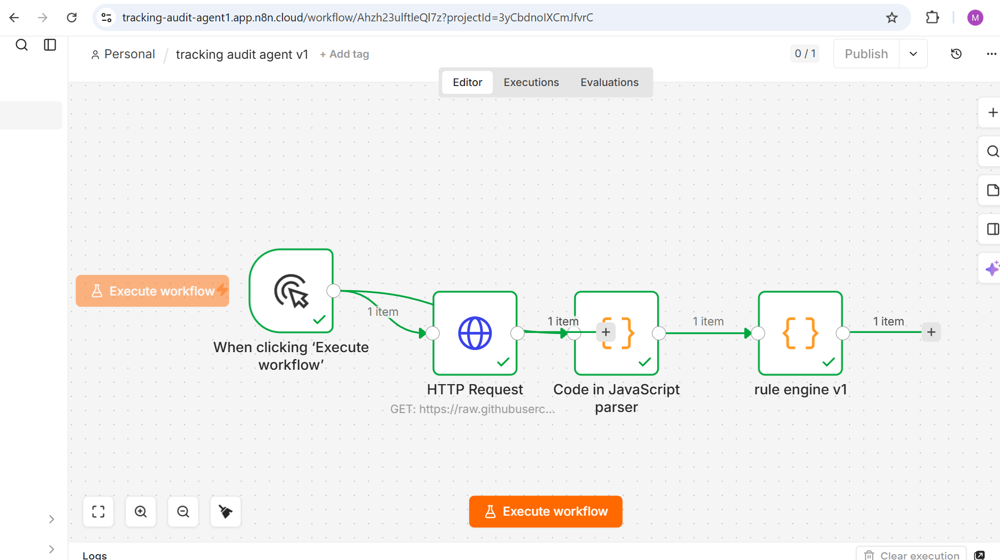
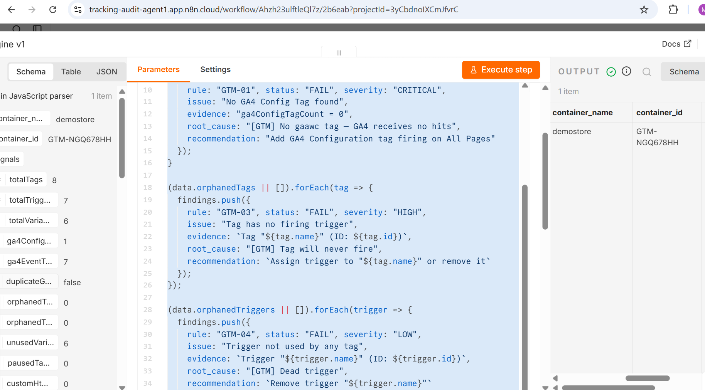
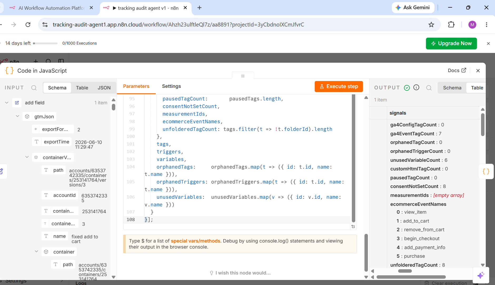

# GTM Audit Agent

Automated Google Tag Manager container auditing pipeline built with n8n, JavaScript, and Gemini API.

## What It Does

Takes a GTM container export JSON, runs structural validation checks via a JavaScript rule engine, and generates a human-readable audit report with health scoring and prioritised remediation recommendations.

**Input:** GTM container export JSON (hosted on GitHub Raw or any HTTP endpoint)

**Output:** Structured findings array and narrative audit report

---

## Features

* Parses GTM container exports
* Detects GA4 configuration issues
* Identifies orphaned tags and triggers
* Detects unused variables
* Validates ecommerce event coverage
* Evaluates consent configuration coverage
* Calculates container health score
* Generates audit findings automatically
* Produces AI-generated audit reports

---

## Pipeline Architecture

```text
GTM Export JSON
        ↓
HTTP Request
        ↓
Parser
        ↓
Rule Engine
        ↓
Gemini API
        ↓
Report Generator
        ↓
Audit Report
```

---

## Rules Implemented

| Rule ID | Description                      |
| ------- | -------------------------------- |
| GTM-01  | Missing GA4 Configuration Tag    |
| GTM-02  | Duplicate GA4 Configuration Tags |
| GTM-03  | Tag Without Trigger              |
| GTM-04  | Unused Trigger                   |
| GTM-05  | Unused Variable                  |
| GTM-06  | Missing Ecommerce Events         |

---

## Tech Stack

* n8n
* JavaScript
* Google Tag Manager
* Gemini API

---

## Repository Structure

```text
gtm-audit-agent/
├── README.md
├── screenshots/
├── workflow/
├── parser/
├── rules/
├── reports/
└── docs/
```

---

## Example Audit Signals

* Total Tags
* Total Triggers
* Total Variables
* GA4 Configuration Tags
* GA4 Event Tags
* Orphaned Tags
* Orphaned Triggers
* Unused Variables
* Consent Coverage
* Ecommerce Event Coverage

---

## Setup

1. Clone repository
2. Import `workflow/n8n-workflow.json` into n8n
3. Replace HTTP Request URL with your GTM export JSON endpoint
4. Add Gemini API key to the HTTP Request1 node headers (`x-goog-api-key`)
5. Execute workflow

---

## Screenshots

### Workflow



### Parser Output



### Audit Report



---

## Author

Poornima K — GTM/GA4 Analytics Implementation

LinkedIn: https://linkedin.com/in/k-poornima

GitHub: https://github.com/skyfall166-jpg
